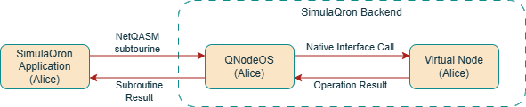
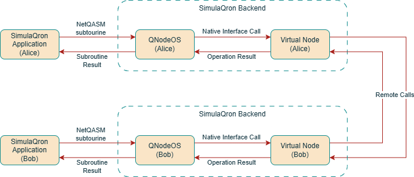
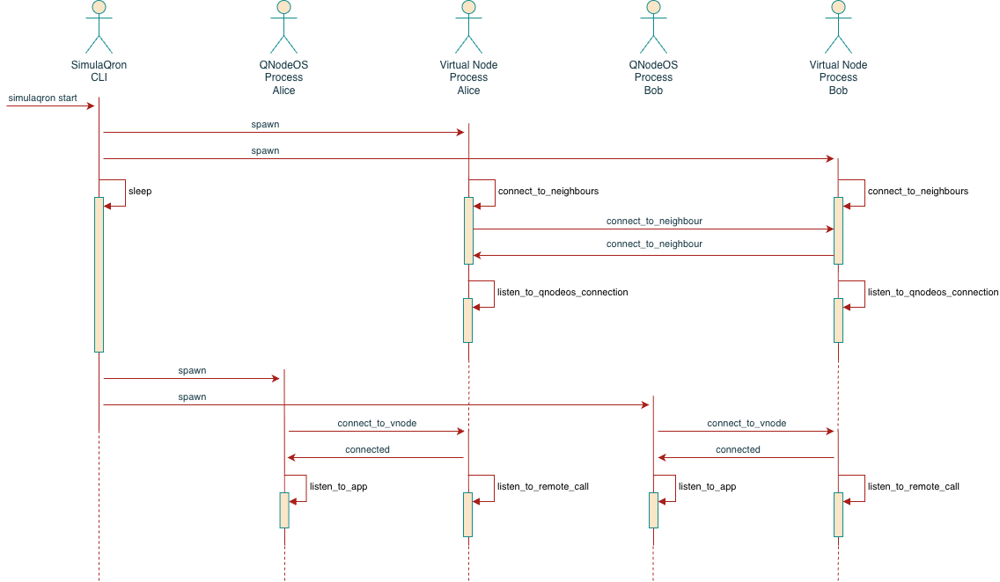
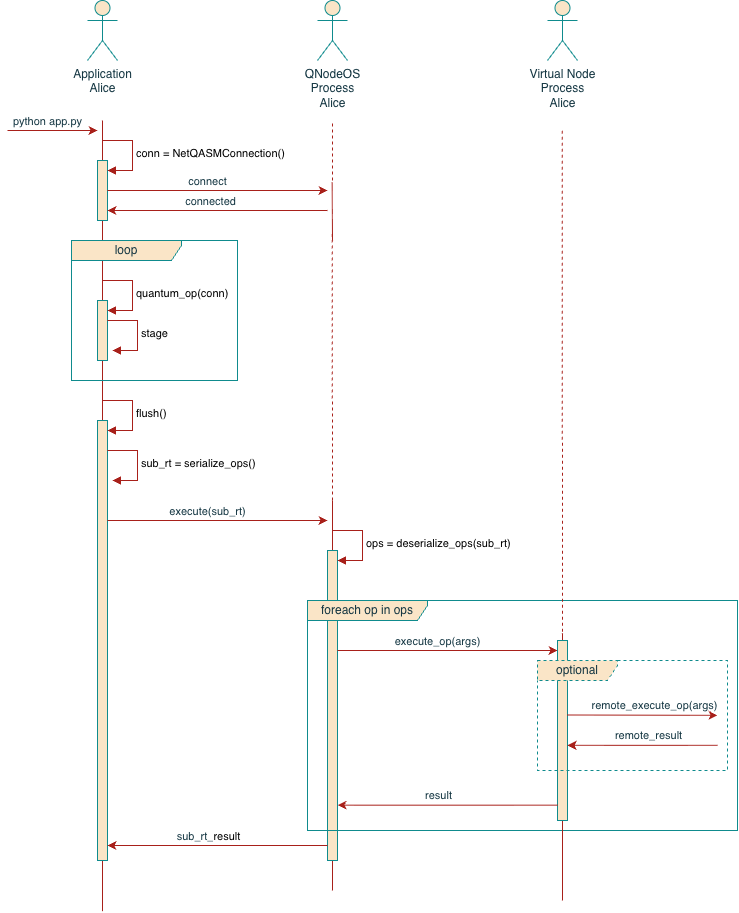

Architecture and Interactions of a SimulaQron App
=================================================

General Application Architecture
--------------------------------

The architecture of a SimulaQron application can be seen in the figure:

When Alice needs to run a *local* quantum operation, it needs follow the process:

#. Alice creates a ``NetQASMConnection``. This opens a connection (a TCP socket) to Alice's backend, specifically to the
   QNodeOS layer.
#. Alice uses the connection to perform quantum operations (allocate qubits, execute gates).
#. Quantum operations *are staged (buffered) in Alice application layer*. This means that *all quantum operations are not
   immediately executed*.
#. At some point, Alice calls ``flush()`` on the connection. This invocation triggers the execution of *all the buffered
   operations*.
#. ``flush()`` translates all the buffered operations into the NetQASM syntax, and groups them into a *NetQASM subroutine*.
   The subroutine is then sent over the TCP connection to the QNodeOS layer.
#. The QNodeOS layer receives the NetQASM subroutine, parses it and executes the quantum operations.
#. To execute the quantum operations, the QNodeOS layer communicates with the Virtual Node layer, which is in charge
   of the final simulation of the quantum hardware.
#. The execution is done using SimulaQron's *native interface*. This makes the QNodeOS server a translation layer
   between NetQASM and SimulaQron's native interface.

In a scenario where more than one node is involved, it is required that the simulated quantum hardware to communicate
with other node's quantum hardware (for example, to create EPR pairs). This is done at Virtual Node level; each Virtual
Node instance keeps an open communication channel with its Virtual Node neighbours, so it can send signals and
information to "remote" nodes. Additionally, this open communication channel is also required due to SimulaQron's
distributed simulation nature. In this case, the general architecture can be seen in the following figure.

Backend Processes Interactions
------------------------------

As explained in the previous section, SimulaQron requires a *backend* to be running when you are using quantum operations.
The SimulaQron backend can be started by using the ``simulaqron`` CLI tool - in particular, the ``simulaqron start``
subcommand.

The ``simulaqron start`` subcommand makes the CLI tool act as a *driver* whose only task is to spawn the backend
processes. SimulaQron uses *2 backend processes per node*:

* QNodeOS process: A server process that implements :doc:`the NetQASM Interface <NetQASM>`. The main purpose of this
  process is to process all the NetQASM subroutines coming from the SimulaQron application, and execute them.
* Virtual Node process: The :ref:`*Virtual Quantum Node* <VNodes>`, a server process that pretends to be quantum
  hardware.

The figure below depicts the process of executing ``simulaqron start --nodes=Alice,Bob`` (we assume that
the settings files are present in the current folder):

The startup of the backend perform the following operations:

#. The CLI tool (``simulaqron``) is invoked with the ``start`` subcommand. In this sense, the CLI tool becomes
   the driver of the whole SimulaQron network backend.
#. The driver spawns the *virtual node* process for both Alice and Bob, and then it sleeps for a while to allow them
   to correctly initialize.
#. When spawned, the virtual node processes setup the internals, and create a connection to *all* the quantum nodes
   neighbours. In the depicted image, we see that Alice connects top Bob, but also Bob to Alice. This is needed since
   any node can send a message (a command to execute quantum operations on a remote) to any of its neighbours. In an
   :math:`n`-nodes configuration, the connections will create a clique graph. Being this said, there will be
   :math:`n\times (n-1)` open connections among all the nodes.
#. After all the connections have been made, the Virtual Node processes will start accepting connections from their
   respective QNodeOS nodes.
#. Once the drive process awakes again, it will spawn the *QNodeOS* processes.
#. When spawned, the QNodeOS processes perform their initialization, and connect to their respective Virtual Node
   processes. This is needed since the QNodeOS processes will later send messages to the Virtual Node processes to
   execute the quantum operations contained in a NetQASM subroutine. Please note that QNodeOS processes *only* connect
   to their respective Virtual Node (Alice QNodeOS connect to and only to Alice Virtual Node process), so quantum
   operations that will require update a qubit hosted by a remote node will trigger a message between Virtual Nodes
   (i.e. the underlying Virtual Node connection is transparent for QNodeOS processes).
#. Once that each QNodeOS process is connected to their Virtual Node, they start listening to connections from the
   application layer.
#. At this stage, the driver and all the spawned processes become daemons, and simply wait for activities in their
   established connections. This is depicted by the dashed line in their respective timelines.

The interactions describes above summarize how the backend processes interact when starting a 2 nodes SimulaQron network.

Application Process Interaction
-------------------------------

Once the backend is running, the application processes (the python software that implements quantum programs) interact
with the backend processes to execute the quantum operations.

In general, the interactions are summarized in the following figure:

When the application process performs quantum operations, this is how they get executed:

#. The application process creates a ``NetQASMConnection`` object (henceforth named ``connection``), passing the
   required argument (EPR Sockets, for example). By creating this object, the application process creates a TCP
   connection with the respective QNodeOS process.
#. The application uses the ``connection`` object to create qubits, and apply quantum operations on the qubits.
#. The application process automatically *buffers* (stages) all these operations locally. This means that the
   quantum operations *are not executed* immediately.
#. At some point, the application process invokes ``connection.flush()`` method, signaling the NetQASM library to
   commit all the staged operations and send them for execution. To this end, the NetQASM library crates a *NetQASM
   subroutine* which contains all the staged operations. The subroutine is then serialized, and sent over the TCP
   connection to the QNodeOS process.
#. Once the QNodeOS process receives the NetQASM subroutine, the NetQASM subroutine get deserialized in the QNodeOS
   process. This step allows the QNodeOS process to understand all the involved operations.
#. For each quantum operation, the QNodeOS process proceeds with its execution. This step involves invoking the right
   remote calls on the Virtual Node process. Subsequentially (and due to SimulaQron distributed nature), executing one
   quantum operation might trigger executing other operation on remote quantum nodes. This makes the "local" Virtual
   Node process (the one that is executing the subroutine) to trigger other remote calls on remote nodes.
#. Once that all the quantum operations have been executed, the QNodeOS process determines the execution result of the
   whole subroutine, and report it back to the application layer.
#. With this result, the application process continues executing the application program.
