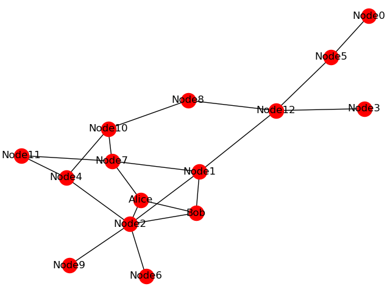

Configuring the simulated network
=================================

-------------------------------
Starting the SimulaQron backend
-------------------------------

The backend of a SimulaQron network is a set of running virtual nodes and their corresponding CQC servers. To start the backend of a SimulaQron network run the command ``simulaqron start``.

With no arguments, a network is by default started with the five nodes Alice, Bob, Charlie, David and Eve. How to adjust the nodes and the topology of the network is described below.

.. warning:: ``simulaqron start`` can fail if any of the ports specified in the config files are already in use by a running SimulaQron network or another program.

To configure networks see section :ref:`networkConfig`.
Finally for instructions on how to connect to an already runnning simulated network using CQC, see section :ref:`remoteNetwork`.

If you want to start a network with for example the three nodes Alex, Bart, Curt, simply type::

    simulaqron start --nodes Alex,Bart,Curt

If you simply want a network with 10 nodes, type::

    simulaqron start --nrnodes 10

This will start up a network where the nodes are called Node0, Node1, ..., Node9.

The --nodes and --nrnodes can be combined. Let's say you want a network with 10 nodes and that three of the nodes are called Alice, Bob and Charlie, type::

    simulaqron start --nodes Alice,Bob,Charlie --nrnodes 10

Which will start up a network with the nodes Alice, Bob, Charlie, Node0, Node1, ..., Node6. If --nrnodes is less than the entries in --nodes, then --nrnodes is ignored. The two keywords can also be specified shorter as -nd and -nn respectively. So the above can also be done as::

    simulaqron start -n Alice,Bob,Charlie -N 10

You can also specify a topology of the network. For example if you want 10 nodes in a ring topology, type::

    simulaqron start --nrnodes 10 --topology ring

In this network Node :math:`i` can create EPR pairs and send qubits to Node :math:`i-1 \pmod{10}` and Node :math:`i+1 \pmod{10}`. However, if a CQC message is sent to for example Node2 to produce entanglement with Node5, a error message (CQC_ERR_UNSUPP) will be returned. The options for the automatically generated topologies are currently:

* `complete`: A fully connected. This is also used if the argument --topology is not used.
* `ring`: A ring network, i.e. a connected topology where every node has exactly two neighbors.
* `path`: A path network, i.e. a connected topology where every node has exactly two neighbors but there are no cycles.
* `random_tree`: Generates a random tree, i.e. a topology without cycles.
* `random_connected_{int}`: Generates a random connected graph with a specified number of edges. For example a random connected network on 10 nodes, can be specified as `random_connected_20`. Note that the number of edges for a network with :math:`n` nodes must be greater or equal to :math:`n-1` and less or equal to :math:`n(n-1)/1`.

Along with setting up the network with the specified topology a .png figure is also generated and stored as config/topology.png. This is useful if a random network is used, to easily visualize the network used.

As a final example let's combine all the arguments specified above and create a network using 15 nodes, where two of then are called Alice and Bob and the topology of the network is randomly generated as a connected graph with 20 edges::

    simulaqron start -n Alice,Bob -N 15 -t random_connected_20

The network that is then started might look like this:

To create a custom topology, see below.

---------------------
Using the --keep flag
---------------------
By default simulaqron will try to overwrite the current network config of a network your trying to start.
For example if you have a network called "my_network" with the nodes Alice, Bob and Charlie and you type::
    
    simulaqron start --name=my_network --nodes=Alice,Bob

simulaqron will ask you if you want to edit the config file to make "my_network" be a network with the nodes Alice and Bob.
However if you add the flag ``--keep``, simulaqron will simply start up Alice and Bob in the network "my_network" without editing the config file.
This is useful if your planning to simulated a network between multiple physical computers.
Since in this case, the node Charlie might be simulated at a differnent computer so you still want the addresses of Charlie in your config file but you don't want to start that node on your computer.

.. note:: If you want to suppress the check from simulaqron whether you want to edit the network config file you can always add the flag ``--force`` (``-f``).

-----------------
Multiple networks
-----------------

To run multiple networks at the same time you need to given them different names by using the --name flag::

    simulaqron start --name NETWORK

To stop a network with a specific name type::

    simulaqron stop --name NETWORK

.. note:: By default the network name is "default". To have multiple networks running at the same time the nodes cannot use the same port numbers.

How multiple networks can be setup is described below.

.. _networkConfig:

-----------------------
Configuring the network
-----------------------
Using the CLI you can add nodes to a network using for example::

    simulaqron nodes add Maria

which adds the node Maria to the default network "default". If you want add a node to another network you can do::

    simulaqron nodes add Maria --network-name="OtherNetwork"

which adds Maria to the network "OtherNetwork".
You can also specify hostname and port numbers to be used for this node including what it's neighbors are using the arguments:

 * ``--hostname``
 * ``--app_port``
 * ``--cqc_port``
 * ``--vnode_port``
 * ``--neighbors``

SimulaQron will ask you before it makes any changes to the network config file. If you wan to suppress this you can add the flag ``--force`` (``-f``).

If you want to build up a (or many) more complex networks it can become tedious to do this through the CLI.
You can instead write your own network config file.
This network config file should be a .json file and could for example look as follows.
An example of such a file can be seen below which contains two networks ("default" and "small_network") which the nodes "Alice", "Bob" and "Test" respectively::

    {
        "default": {
            "nodes": {
                "Alice": {
                    "app_socket": [
                        "localhost",
                        8000
                    ],
                    "cqc_socket": [
                        "localhost",
                        8001
                    ],
                    "vnode_socket": [
                        "localhost",
                        8004
                    ]
                },
                "Bob": {
                    "app_socket": [
                        "localhost",
                        8007
                    ],
                    "cqc_socket": [
                        "localhost",
                        8008
                    ],
                    "vnode_socket": [
                        "localhost",
                        8010
                    ]
                }
            },
            "topology": null
        }
        "small_network": {
            "nodes": {
                "Test": {
                    "app_socket": [
                        "localhost",
                        8031
                    ],
                    "cqc_socket": [
                        "localhost",
                        8043
                    ],
                    "vnode_socket": [
                        "localhost",
                        8089
                    ]
                }
            },
            "topology": null
        }
    }

If you want simulaqron to use your custom network.json file simply set this in the settings by ``simulaqron set network-config-file your/path/my_network.json`` or add the following line to a file ``~/.simulaqron.json``: ``network_config_file: your/path/my_network.json``, where ``your/path/my_network.json`` is the path to your custom network config file.

The entries ``"topology"`` can be used to define the topology of the network.
This could for example be::

    {
     "Alice": ["Bob"],
     "Bob": ["Alice", "Charlie"]
     "Charlie": ["Bob"]
    }

descibing network where Alice is adjacent to Bob, Bob is adjacent to Alice and Charlie and Charlie is adjacent to Bob.

.. note:: Undirected topologies are also supported. That is, networks where for example Alice can send a qubit to Bob but Bob cannot send a qubit to Alice.

------------------------------
Starting a network from Python
------------------------------

You can also start a network within a Python script (this is in fact what simulaqron does), by using the class :code:`simulaqron.network.Network`. To setup a network by name "test" with the nodes Alice, Bob and Charlie, where Bob is connected with Alice and Charlie but Alice and Charlie are not connected use the following code code::

   from simulaqron.network import Network

   def main():
       # Setup the network
       nodes = ["Alice", "Bob", "Charlie"]
       topology = {"Alice": ["Bob"], "Bob": ["Alice", "Charlie"], "Charlie": ["Bob"]}
       network = Network(name="test", nodes=nodes, topology=topology)

       # Start the network
       network.start()

       input("To stop the network, press enter...")

   if __name__ == '__main__':
       main()

By default the method :code:`simulaqron.network.Network.start`, only returns when the network is running, i.e. all the connections are established. To avoid this use the argument :code:`wait_until_running=False`.

.. note:: The network will stop when the network-object goes out of scope and is handled by the Python garbade collector. The network can be manually stopped with the method :code:`simulaqron.network.Network.stop`.
