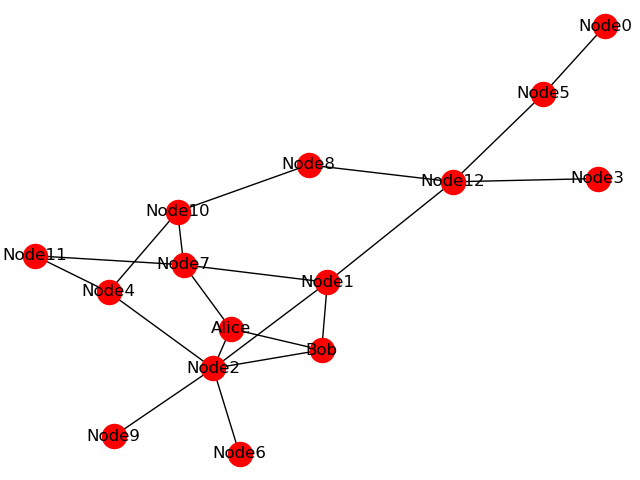

Configuring the simulated network
=================================

-------------------------------
Starting the SimulaQron backend
-------------------------------

The backend of a SimulaQron network is a set of running virtual nodes and their corresponding `VirtualNode` servers. Starting a SimulaQron network requires using SimulaQron and network configuration files.

To start the backend of a SimulaQron network run the command ``simulaqron start``.

The command can receive certain arguments to control the simulated network:

* ``--simulaqron-config-file=PATH`` (optional): Specifies a path for the SimulaQron config file to use for the backend. If not given, simulaqron will try to read a file named ``simulaqron_settings.json`` in the current folder.
* ``--network-config-file=PATH`` (optional): Specifies a path for the network config file to use for the backend. If not given, simulaqron will try to read a file named ``simulaqron_network.json`` in the current folder.
* ``--name=<network-name>`` (optional): Specifies the name of the network to start. This name must correspond to one of the names specified on the given network configuration file. If this argument is not given, this value is defaulted to ``default``.
* ``--nodes <nodes_list>`` (`required`): Specifies which nodes to simulate. The ``<nodes_list>`` value is a comma separated list of the nodes names to start. All the specified node names must exist within the specified network inside the network configuration file.

How to adjust the nodes and the topology of the network is described below.

.. warning:: ``simulaqron start`` can fail if any of the ports specified in the config files are already in use by a running SimulaQron network or another program.

If you want to start a network with, for example, the three nodes Alex, Bart, Curt from the network named ``network``, simply type::

    simulaqron start --name network --nodes Alex,Bart,Curt

.. _networkConfig:

-----------------------
Configuring the network
-----------------------
SimulaQron requires specifying a json-based network configuration. This configuration states the name of the node, and IP address/port tuples to correctly connect the SimulaQron simulations and classical communication sockets.

For each configured node, you need to specify IP and address for 3 fields:
* The ``app_socket`` field, which specifies the IP and port for connecting classical communication sockets.
* The ``qnodeos_socket`` field, which specifies the IP and port for connecting the QnodeOS server, used to interpret NetQASM objects.
* The ``vnode_socket`` field, which specifies the IP and port for the SimulaQron VirtualNode object, which runs the quantum simulation.

Using the CLI you can add nodes to a network::

    simulaqron nodes add Maria

which adds the node Maria to the default network "default". If you want add a node to another network you can do::

    simulaqron nodes add Maria --network-name="OtherNetwork"

which adds Maria to the network "OtherNetwork". With no extra arguments, this invocation will configure all the sockets fields on ``localhost``, assigning a random port in the 8000-9000 range.
You can also specify hostname and port numbers to be used for this node including what it's neighbors are using the arguments:

 * ``--hostname``
 * ``--app-port``
 * ``--qnodeos-port``
 * ``--vnode-port``
 * ``--neighbors``

If you want to build up a (or many) more complex network, it can become tedious to do this through the CLI.
You can instead write your own network config file, as a .json file.
An example of such a file can be seen below which contains two networks ("default" and "small_network") which the nodes "Alice", "Bob" and "Test" respectively::

    {
        "default": {
            "nodes": {
                "Alice": {
                    "app_socket": [
                        "localhost",
                        8000
                    ],
                    "qnodeos_socket": [
                        "localhost",
                        8001
                    ],
                    "vnode_socket": [
                        "localhost",
                        8004
                    ]
                },
                "Bob": {
                    "app_socket": [
                        "localhost",
                        8007
                    ],
                    "qnodeos_socket": [
                        "localhost",
                        8008
                    ],
                    "vnode_socket": [
                        "localhost",
                        8010
                    ]
                }
            },
            "topology": null
        }
        "small_network": {
            "nodes": {
                "Test": {
                    "app_socket": [
                        "localhost",
                        8031
                    ],
                    "cqc_socket": [
                        "localhost",
                        8043
                    ],
                    "vnode_socket": [
                        "localhost",
                        8089
                    ]
                }
            },
            "topology": null
        }
    }

If you want simulaqron to use your custom network.json file simply place it in the same folder where you are running your code, and name it ``simulaqron_network.json``. You can also use name it differently, but make sure that you manually load this file in your python code::

    from simulaqron.settings import network_config
    ...

    network_config.read_from_file("/path/to/your/simulaqron_network.json")

The entries ``"topology"`` can be used to define the topology of the network.
This could for example be::

    {
     "Alice": ["Bob"],
     "Bob": ["Alice", "Charlie"]
     "Charlie": ["Bob"]
    }

describing a network topology where Alice is adjacent to Bob, Bob is adjacent to Alice and Charlie and Charlie is adjacent to Bob.

.. note:: Undirected topologies are also supported. That is, networks where for example Alice can send a qubit to Bob but Bob cannot send a qubit to Alice.

---------------------------
Generate network topologies
---------------------------

The simulaqron tool is also capable of automatically generating network configuration with certain network topologies.
The options for the automatically generated topologies are currently:

* `complete`: A fully connected. This is also used if the argument --topology is not used.
* `ring`: A ring network, i.e. a connected topology where every node has exactly two neighbors.
* `path`: A path network, i.e. a connected topology where every node has exactly two neighbors but there are no cycles.
* `random_tree`: Generates a random tree, i.e. a topology without cycles.
* `random_connected_{int}`: Generates a random connected graph with a specified number of edges. For example a random connected network on 10 nodes, can be specified as `random_connected_20`. Note that the number of edges for a network with :math:`n` nodes must be greater or equal to :math:`n-1` and less or equal to :math:`n(n-1)/1`.

TODO - Implement a command in the CLI to invoke the generation of topologies.
TODO - Document that CLI command.

Along with setting up the network with the specified topology a .png figure is also generated and stored as config/topology.png. This is useful if a random network is used, to easily visualize the network used.

The network that is then started might look like this:

To create a custom topology, see below.

-----------------
Multiple networks
-----------------

To run multiple networks at the same time you need to give them different names in the network configuration file, and then use the names to start them by using the --name flag::

    simulaqron start --name NETWORK

To stop a network with a specific name type::

    simulaqron stop --name NETWORK

.. note:: By default the network name is "default". To have multiple networks running at the same time the nodes cannot use the same port numbers.

How multiple networks can be setup is described below.
